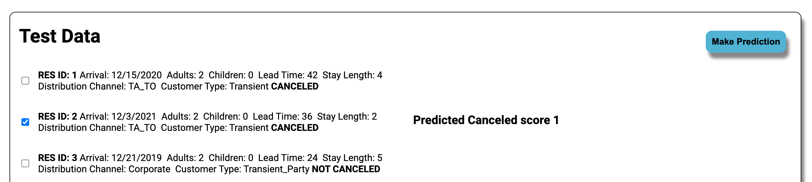

# __Venture Inc. Machine Learning Dashboard__

 
 

## __Quick Start Guide__  

   

### __System requirements:__  
* Developed with Visual Studio Code v 1.74.2
* NodeJS with npm
    * node v 19.1.0
    * npm v 8.19.3
* Python 3:  v 3.9.6  
    use Python's package manager to install the following  
    modules  
    Ex. pip install pandas==1.5.2
    * pandas v 1.5.2
    * numpy v 1.23.5
    * scikit-learn v 1.1.3
    * sqlite3  ( _included in standard library_ )
* REACT v 18.2.0  
  
 
Apart from NodeJS, Python 3, and the 3rd party python modules, all other project dependencies, including the correct version of REACT, are listed in the package.json file.  

To install all necessary modules and dependencies open a terminal in the project directory and type: npm i  

 

## __Two Ways to Play__

 

__There are two ways to start the application.__
   
First open a terminal in the project's top level directory.  
Run the command: node server.js  
This starts the server that provides the machine learning model API  
and the production bundle of the app if built.  
  
After the server is running you can do one of the following:

1) Use the REACT development server to view the app in your default browser at http://localhost:3000  
To do so run the command: npm start  
  __OR__  
2) Create a production build of the app.  
To do so run the command: npm run build  
In a browser navigate to http://localhost:3001 
   

### __Using the application__
The Dashboard displays three graphs for data visualization- 2 bar charts and 1 pie chart.  
The application database is prepopulated with three reservations taken from the original dataset. These reservations were not used to train or test the model. Click the checkbox next to a reservation to enable the Make Prediction button in the upper right corner of a data box. Click make a prediction to see the models result printed next to the selected record.

__After selecting a record__

### __Making a new reservation to test__

Click the New Reservation button in the upper right corner of the Dashboard main page.

The New Reservation form allows you to enter a name, number of adults and children, and the check-in and check-out dates. For simplicity of the beta version, other reservation features will be auto-populated. All form fields are required to create a new reservation.

If a new reservation is successfully made, the user will be redirected back to the main page.  

Clicking the Cancel buttons will also take the user back to the main page.  

The new reservation can now be processed by the model in the same manner as the test data.
